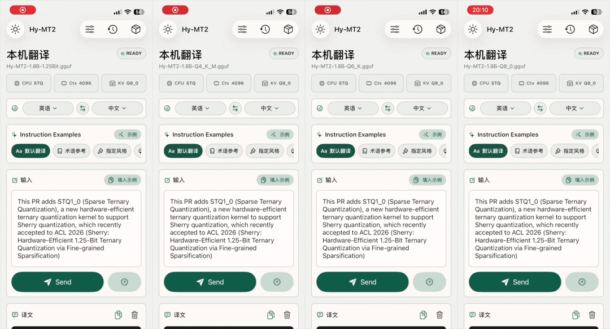

# HyMT

[中文说明](README.zh-CN.md)

HyMT is an iOS local translation app based on `llama.cpp`.

This branch is only intended for running Tencent Hy-MT / Hy-MT2 GGUF translation models on iPhone. It is not a general-purpose `llama.cpp` distribution branch.

## What This Branch Is For

- Run Hy-MT2 translation models locally on iPhone
- Download supported Hy-MT2 GGUF model files inside the app
- Test STQ / low-bit Hy-MT2 inference through the iOS SwiftUI app
- Compare 1.25Bit, 2Bit, Q4_K_M, Q6_K, and Q8_0 models on device

## What This Branch Is Not For

- It does not redistribute Hy-MT2 model weights
- It is not meant to replace upstream `llama.cpp`
- It is not a general model browser for arbitrary GGUF files
- It currently targets CPU inference on iPhone

## A15 Performance



The demo above shows the same HyMT iOS app running Hy-MT2-1.8B 1.25Bit, Q4_K_M, Q6_K, and Q8_0 variants on iPhone.

On an A15 iPhone, the Hy-MT2-1.8B 1.25Bit GGUF model reached about **17 tokens/s** in local translation inference.

In the same app/device test, the Hy-MT2-1.8B Q8 model reached about **0.22 tokens/s**.

That makes the 1.25Bit model about **77x faster** than Q8 in this A15 test:

```text
17 / 0.22 = 77.27
```

These numbers are device- and prompt-dependent, but they show why this branch focuses on low-bit Hy-MT2 inference for iPhone.

## App Location

The iOS app lives here:

```text
examples/llama.swiftui
```

Open this Xcode project:

```text
examples/llama.swiftui/llama.swiftui.xcodeproj
```

## Model Weights

Model weights are not included in this repository.

The app can download supported Hy-MT2 GGUF files from:

- Hugging Face / HF Mirror
- ModelScope mirror for 1.25Bit and 2Bit

Users must comply with the Hy-MT2 model license. See:

- https://github.com/Tencent-Hunyuan/Hy-MT2
- https://huggingface.co/tencent/Hy-MT2-1.8B-1.25Bit-GGUF
- https://huggingface.co/tencent/Hy-MT2-1.8B-2Bit-GGUF
- https://huggingface.co/tencent/Hy-MT2-1.8B-GGUF

## Requirements

- macOS
- Xcode
- An iPhone connected by USB
- Apple Developer account / personal development signing
- iOS 16.4 or newer target support

The app was tested as a Debug build on a physical iPhone.

## Build With Xcode

1. Clone this branch:

   ```sh
   git clone -b HYMT https://github.com/baicai-1145/llama.cpp.git
   cd llama.cpp
   ```

2. Open the iOS project:

   ```sh
   open examples/llama.swiftui/llama.swiftui.xcodeproj
   ```

3. In Xcode, select the `llama.swiftui` target.

4. In **Signing & Capabilities**:

   - Select your Apple development team
   - Change the bundle identifier from `com.example.hymt` to one you own, for example `com.yourname.hymt`

5. Select your connected iPhone as the run destination.

6. Press **Run**.

The app display name is `HyMT`.

## Build From Command Line

Find your connected device ID:

```sh
xcrun devicectl list devices
```

Then build:

```sh
xcodebuild \
  -project examples/llama.swiftui/llama.swiftui.xcodeproj \
  -scheme llama.swiftui \
  -configuration Debug \
  -destination 'platform=iOS,id=<DEVICE_ID>' \
  -derivedDataPath ./DerivedData \
  -allowProvisioningUpdates \
  DEVELOPMENT_TEAM=<YOUR_TEAM_ID> \
  PRODUCT_BUNDLE_IDENTIFIER=<YOUR_BUNDLE_ID> \
  build
```

Example:

```sh
xcodebuild \
  -project examples/llama.swiftui/llama.swiftui.xcodeproj \
  -scheme llama.swiftui \
  -configuration Debug \
  -destination 'platform=iOS,id=00000000-0000000000000000' \
  -derivedDataPath ./DerivedData \
  -allowProvisioningUpdates \
  DEVELOPMENT_TEAM=XXXXXXXXXX \
  PRODUCT_BUNDLE_IDENTIFIER=com.example.hymt.dev \
  build
```

## Install On iPhone

After building, install the app:

```sh
xcrun devicectl device install app \
  --device <DEVICE_ID> \
  ./DerivedData/Build/Products/Debug-iphoneos/llama.swiftui.app
```

If you used a different `-derivedDataPath`, update the app path accordingly.

## Run On iPhone

1. Open `HyMT` on the iPhone.
2. Go to **Models**.
3. Select a download source:
   - `ModelScope`
   - `Hugging Face`
   - `HF Mirror`
4. Download one supported Hy-MT2 GGUF model.
5. Tap `Load` for the downloaded model.
6. Return to the main screen.
7. Select source and target languages.
8. Enter text and tap `Send`.

Recommended first test on memory-constrained iPhones:

```text
Hy-MT2-1.8B 1.25Bit
```

Q4, Q6, and Q8 models need more memory and may fail on lower-memory devices.

## Runtime Notes

- Current app backend: CPU
- Context size: configured in `LlamaContext`
- KV cache options: F16 and Q8_0
- Translation output and logs are shown separately
- Translation history is stored locally on device
- Downloaded models are stored in the app's Documents directory

## Do Not Commit Model Files

Do not commit `.gguf` files.

They are intentionally ignored by `.gitignore`. This repository should contain app code and download logic only.

## Upstream And License

This branch is based on:

- https://github.com/ggml-org/llama.cpp

`llama.cpp` is licensed under the MIT License. See `LICENSE`.

Hy-MT2 model weights use their own license terms from Tencent. The model license is separate from this repository's code license.

More attribution details are in:

```text
NOTICE-HyMT.md
```
